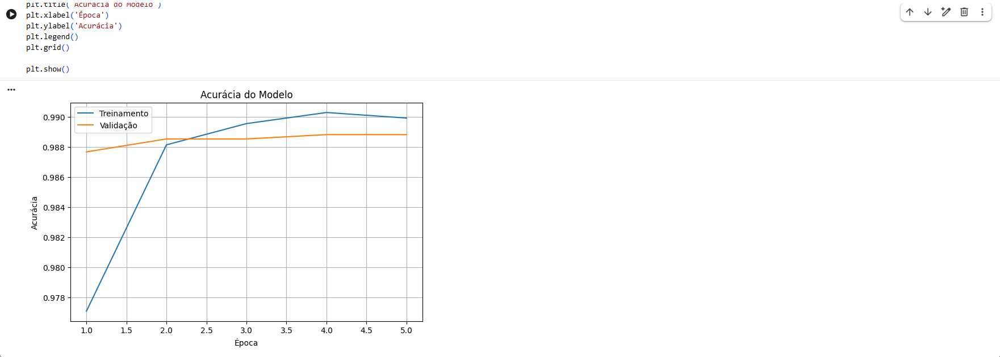
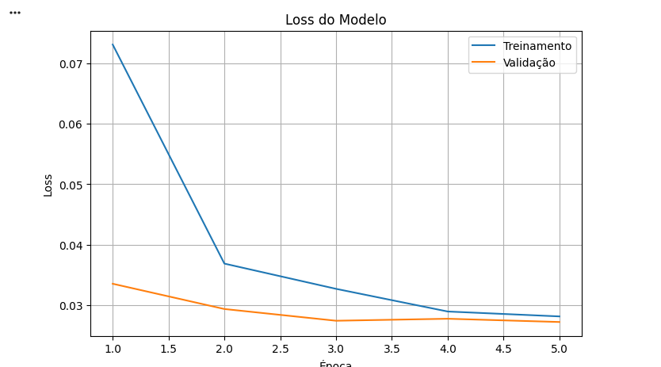
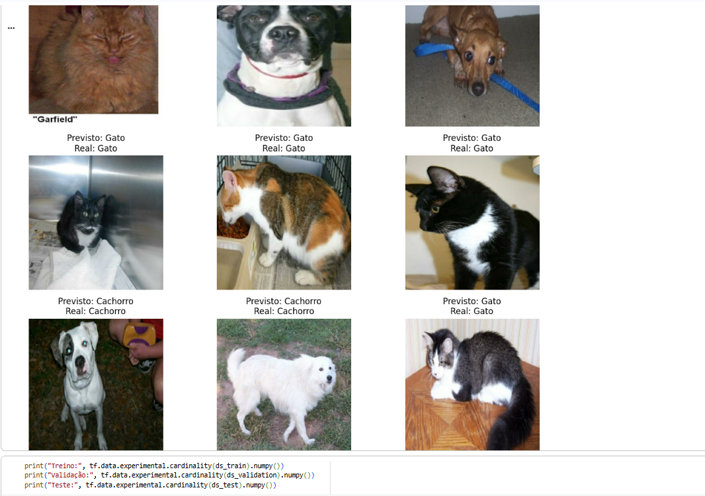

# 🐱🐶 Classificação de Gatos e Cachorros com Transfer Learning

Projeto desenvolvido como parte do desafio de **Transfer Learning** da **Digital Innovation One (DIO)**.

O objetivo deste projeto é aplicar técnicas de **Deep Learning e Transfer Learning** para realizar a classificação de imagens entre duas classes: **gatos e cachorros**.

## 📌 Sobre o Projeto

Neste projeto foi utilizada a arquitetura **MobileNetV2**, uma rede neural convolucional pré-treinada no dataset **ImageNet**.

Por meio do Transfer Learning, aproveitamos os conhecimentos previamente adquiridos pela MobileNetV2 e adaptamos a rede para realizar uma nova tarefa de classificação.

As classes utilizadas foram:

* 🐱 Gato
* 🐶 Cachorro

## 🗂️ Dataset

Foi utilizado o dataset **Cats vs Dogs**, disponibilizado através do TensorFlow Datasets.

Os dados foram divididos em:

* **70%** para treinamento;
* **15%** para validação;
* **15%** para teste.

As imagens foram redimensionadas para **224 × 224 pixels** antes de serem utilizadas pela MobileNetV2.

## 🧠 Transfer Learning

A MobileNetV2 foi carregada utilizando pesos previamente treinados no **ImageNet**:

```python id="u10jgo"
base_model = MobileNetV2(
    input_shape=(224, 224, 3),
    include_top=False,
    weights='imagenet'
)
```

Inicialmente, as camadas da rede pré-treinada foram congeladas:

```python id="xbxrw1"
base_model.trainable = False
```

Dessa forma, os conhecimentos adquiridos anteriormente pela MobileNetV2 puderam ser reutilizados para a nova tarefa de classificação.

## ⚙️ Arquitetura

A estrutura utilizada no projeto foi:

```text id="w2kk64"
Imagem 224x224
      ↓
MobileNetV2
      ↓
GlobalAveragePooling2D
      ↓
Dropout
      ↓
Dense (Sigmoid)
      ↓
Gato ou Cachorro
```

A função de ativação **Sigmoid** foi utilizada na camada de saída por se tratar de um problema de classificação binária.

## 🚀 Treinamento

O modelo foi compilado utilizando:

* **Otimizador:** Adam
* **Learning Rate:** 0.001
* **Função de perda:** Binary Crossentropy
* **Métrica:** Accuracy
* **Épocas:** 5
* **Batch Size:** 32

Durante o treinamento, o modelo apresentou os seguintes resultados na quinta época:

```text id="n8s3rq"
Accuracy: 98,99%
Validation Accuracy: 98,88%
Loss: 0,0281
Validation Loss: 0,0272
```

## 📊 Resultado Final

Após o treinamento, o modelo foi avaliado utilizando o conjunto de teste.

O resultado obtido foi:

```text id="ruxcbj"
Loss no teste: 0.0319
Acurácia no teste: 98.91%
```

### 🎯 Acurácia final: **98,91%**

O resultado demonstra a eficiência do Transfer Learning para problemas de classificação de imagens, permitindo alcançar uma alta precisão sem a necessidade de treinar uma rede neural convolucional completamente do zero.

### 📈 Gráfico de Acurácia

O gráfico abaixo apresenta a evolução da acurácia durante as 5 épocas de treinamento.



Na última época, o modelo alcançou aproximadamente **98,99% de acurácia no treinamento** e **98,88% de acurácia na validação**.

### 📉 Gráfico de Loss

O gráfico abaixo apresenta a evolução da função de perda (loss) durante as 5 épocas de treinamento.



A redução e estabilização da loss indicam que o modelo conseguiu aprender características relevantes para diferenciar gatos e cachorros.

Na última época, foram obtidos aproximadamente **0,0281 de loss no treinamento** e **0,0272 de loss na validação**.

## 🔎 Previsões

O modelo também foi utilizado para realizar previsões em imagens do conjunto de teste.

Para cada imagem foram comparadas:

* Classe prevista pelo modelo;
* Classe real da imagem.

Exemplo:

```text id="n6bxm4"
Previsto: Gato
Real: Gato

Previsto: Cachorro
Real: Cachorro
```

Essa etapa permite verificar visualmente o desempenho do modelo.

### 🖼️ Exemplos de Previsões

A imagem abaixo apresenta algumas classificações realizadas pelo modelo, comparando a classe prevista com a classe real.



### 🔍 Análise dos Erros

Apesar da alta acurácia obtida pelo modelo, algumas classificações incorretas podem ser observadas na imagem acima. Em alguns casos, imagens de cachorros foram classificadas como gatos.

Esses erros demonstram que uma acurácia elevada não significa que o modelo seja perfeito. Determinadas características das imagens, como posição do animal, enquadramento, iluminação, fundo ou características visuais específicas, podem dificultar a classificação.

Mesmo apresentando alguns erros individuais, o modelo alcançou **98,91% de acurácia no conjunto de teste**, indicando um bom desempenho geral.

A análise visual das previsões complementa as métricas numéricas e ajuda a compreender tanto os acertos quanto as limitações do modelo.

## 🛠️ Tecnologias Utilizadas

* Python
* TensorFlow
* Keras
* TensorFlow Datasets
* MobileNetV2
* NumPy
* Matplotlib
* Google Colab
* GitHub

## 📁 Estrutura do Repositório

```text id="8eskr7"
desafio-transfer-learning-dio/
│
├── README.md
├── transfer_learning_cats_dogs.ipynb
│
└── images/
    ├── accuracy.png
    ├── loss.png
    └── predicoes.png
```

## 💡 Conceitos Aplicados

Durante o desenvolvimento deste projeto foram aplicados conceitos de:

* Deep Learning;
* Redes Neurais Convolucionais (CNN);
* Transfer Learning;
* Processamento de imagens;
* Classificação binária;
* Treinamento e validação de modelos;
* Avaliação utilizando conjunto de teste.

## 📈 Conclusão

O desenvolvimento deste projeto permitiu aplicar na prática os conceitos de **Transfer Learning utilizando Deep Learning**.

A utilização da MobileNetV2 pré-treinada no ImageNet possibilitou aproveitar características visuais previamente aprendidas pela rede e adaptá-las para a classificação entre gatos e cachorros.

O modelo alcançou **98,91% de acurácia no conjunto de teste**, demonstrando a eficiência da abordagem utilizada.

Este projeto também possibilitou praticar todo o processo de desenvolvimento de um modelo de Machine Learning, desde a preparação dos dados até o treinamento, validação, avaliação e documentação dos resultados.

## 👨‍💻 Autor

Projeto desenvolvido para o desafio de Transfer Learning da **Digital Innovation One (DIO)**.
